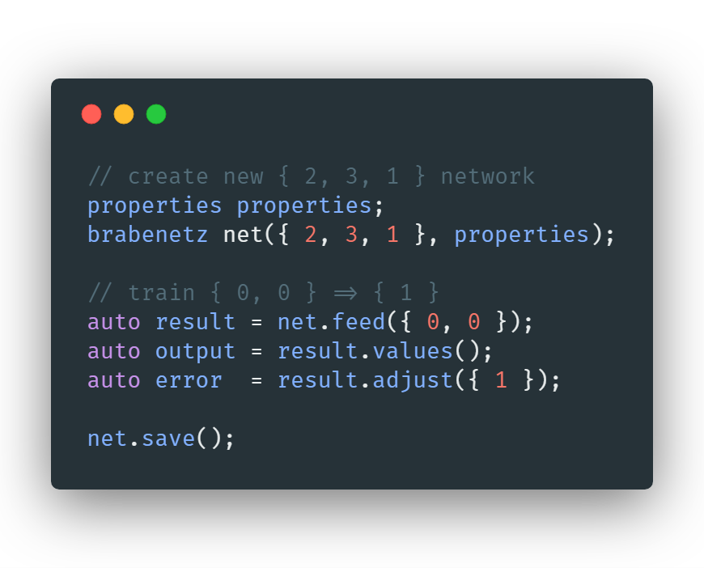

# BrabeNetz


> **BrabeNetz** is a **supervised neural network** written in C++, aiming to be as fast as possible. It can effectively multithread on the **CPU** where needed, is heavily **performance optimized** and is well inline-documented.

[](https://www.nuget.org/packages/BrabeNetz/)
[](https://www.nuget.org/packages/BrabeNetz)

```sh
PM> Install-Package BrabeNetz
```

I've written two examples of using **BrabeNetz** in the [Trainer class](https://github.com/mrousavy/BrabeNetz/blob/master/BrabeNetzConsole/Trainer.cpp) to train a **XOR** (`{0,0}=0`, `{0,1}=1`, ..) and **recognize handwritten characters**.

In my XOR example, I'm using a `{2,3,1}` topology (`2` input-, `3` hidden- and `1` output-neurons), but **BrabeNetz** is scalable until the hardware reaches its limits. The digits recognizer is using a `{784,500,100,10}` network to train handwritten digits from the [MNIST DB](http://yann.lecun.com/exdb/mnist/).

Be sure to [read the network description](DESCRIPTION.md), and **check out my [digit recognizer written in Qt](https://github.com/mrousavy/DigitRecognizer)** (using a trained BrabeNetz MNIST dataset)

## Benchmarks

> **Build:** Release x64 | Windows 10 64bit
>
> **CPU:** Intel i7 6700k @ 4.0GHz x 8cores
>
> **RAM:** HyperX Fury DDR4 32GB CL14 2400MHz
>
> **SSD:** Samsung 850 EVO 540MB/s
>
> **Commit:** [53328c3](https://github.com/mrousavy/BrabeNetz/commit/53328c3f6cc2f166ad79c7c8d01a4e6a739c3b93)

<p align="center">
   
   <p align="center">Training a <b>XOR</b> 1000 times takes just <b>0.49ms</b></p>
</p>
<p align="center">
   
   <p align="center"><b>Actual prediction</b> of the digit recognizer network</p>
</p>
<p align="center">
   
   <p align="center">Effectively using <b>all available cores</b> (24/24, 100% workload)</p>
</p>
<p align="center">
   
   <p align="center">BrabeNetz running on <a href="https://github.com/mrousavy/BrabeNetz/tree/master/Linux">Linux</a> (Debian 9, Linux 4.9.62, KDE Plasma)</p>
</p>
<p align="center">
   
   <p align="center">Task Resource viewer (htop) on <a href="https://github.com/mrousavy/BrabeNetz/tree/master/Linux">Linux</a> (Debian 9, Linux 4.9.62, KDE Plasma)</p>
</p>

## Specs

* **Optimized algorithms** via **raw arrays**instead of `std::vector` and more
* Smart **multithreading** by [OpenMP](http://www.openmp.org/) anywhere the spawn-overhead is worth the performance gain
* **Scalability** (Neuron size, Layer count) - only limited by hardware
* **Easy to use** (Inputs, outputs)
* **Randomly generated values** to begin with
* Easily binary save/load with `network::save(string)`/`network::load(string)` (`state.nn` file)
* **Sigmoid** squashing function
* **Biases** for each neuron
* `network_topology` helper objects for loading/saving state and inspecting network
* `brabenetz` wrapper class for an **easy-to-use interface**

## Usage

<p align="center">
    
</p>

1. Build & link library
    * See: [build/link instructions](https://github.com/mrousavy/BrabeNetz/blob/master/BUILD.md)

2. Choose your interface
    1. `brabenetz.h`: _[Recommended]_ A wrapper for the raw `network.h` interface, but with **error handling** and **modern C++ interface** styling such as `std::vector`s, `std::exception`s, etc.
    2. `network.h`: The raw `network` with C-style arrays and no bound/error checking. **Only use this if _performance_ is important.**

3. Constructors
    1. `(initializer_list<int>, properties)`: Construct a new neural network with the given network size (e.g. `{ 2, 3, 4, 1 }`) and randomize all base weights and biases - [ref](https://github.com/mrousavy/BrabeNetz/blob/master/BrabeNetz/BrabeNetz.h#L76-L92)
    2. `(network_topology&, properties)`: Construct a new neural network with the given network topology and import it's existing weights and biases - [ref](https://github.com/mrousavy/BrabeNetz/blob/master/BrabeNetz/BrabeNetz.h#L94-L104)
    3. `(string, properties)`: Construct a new neural network with and load the neural network state from the file specified in `properties.state_file` - [ref](https://github.com/mrousavy/BrabeNetz/blob/master/BrabeNetz/BrabeNetz.h#L106-L116)

4. Functions
    1. `network_result brabenetz::feed(std::vector<double>& input_values)`: Feed the network input values and forward propagate through all neurons to estimate a possible output (Use the `network_result` structure ([ref](https://github.com/mrousavy/BrabeNetz/blob/master/BrabeNetz/BrabeNetz.h#L11-L57)) to access the result of the forward propagation, such as `.values` to view the output) - [ref](https://github.com/mrousavy/BrabeNetz/blob/master/BrabeNetz/BrabeNetz.h#L128-L140)
    2. `double network_result::adjust(std::vector<double>& expected_output)`: Backwards propagate through the whole network to adjust wrong neurons for result trimming and return the total network error - [ref](https://github.com/mrousavy/BrabeNetz/blob/master/BrabeNetz/BrabeNetz.h#L35-L51)
    3. `void brabenetz::save(string path)`: Save the network's state to disk by serializing weights - [ref](https://github.com/mrousavy/BrabeNetz/blob/master/BrabeNetz/BrabeNetz.h#L142-L149)
    4. `void brabenetz::set_learnrate(double value)`: Set the network's learning rate. It is good practice and generally recommended to use one divided by the train count, so the learn rate decreases the more often you train - [ref](https://github.com/mrousavy/BrabeNetz/blob/master/BrabeNetz/BrabeNetz.h#L151-L162)
    5. `network_topology& brabenetz::build_topology()`: Build and set the network topology object of the current network's state (can be used for network visualization or similar) - [ref](https://github.com/mrousavy/BrabeNetz/blob/master/BrabeNetz/BrabeNetz.h#L164-L172)

Usage examples can be found [here](https://github.com/mrousavy/BrabeNetz/blob/master/BrabeNetzConsole/BrabeNetzConsole.cpp), and [here](https://github.com/mrousavy/BrabeNetz/blob/master/BrabeNetzConsole/Trainer.cpp)

> Thanks for using **BrabeNetz**!

<a href='https://ko-fi.com/F1F8CLXG' target='_blank'></a>
