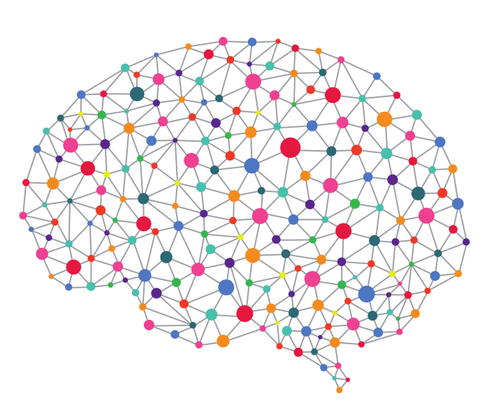
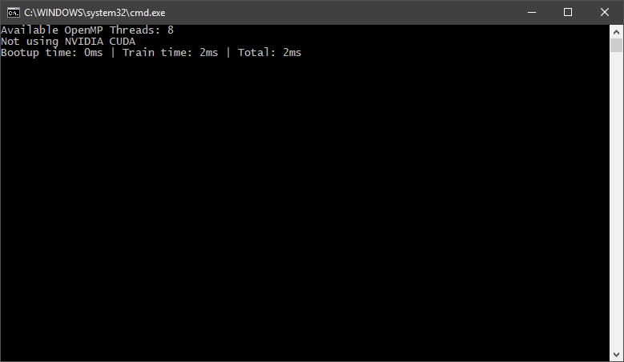
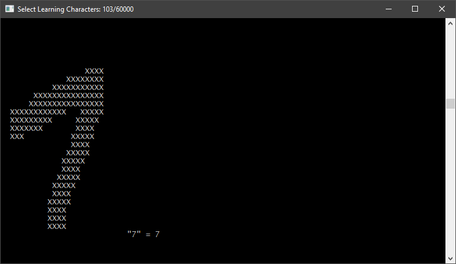
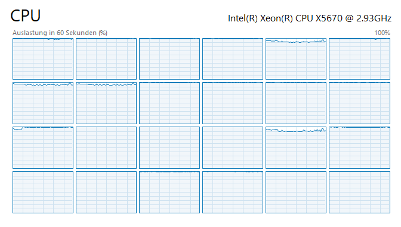
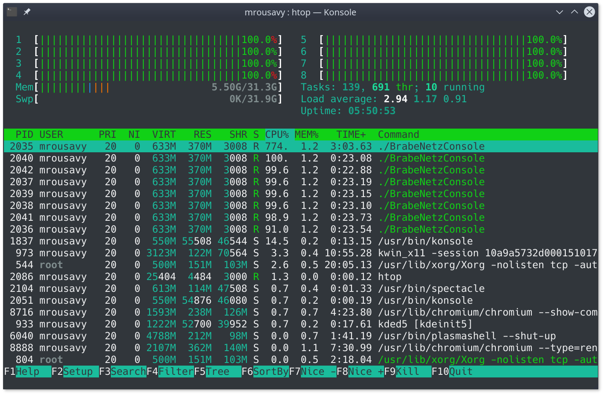

# BrabeNetz

> **BrabeNetz** is a **supervised neural network** written in C++, aiming to be as fast as possible. It can effectively multithread on the **CPU** where needed, allocate and free fast (by `malloc`/`free`), access values faster (pointer-arrays instead of `vector`) and is well documented.

I've written two examples of using **BrabeNetz** in the [Trainer class](https://github.com/mrousavy/BrabeNetz/blob/master/BrabeNetzConsole/Trainer.cpp) to train a **XOR** (`{0,0}=0`, `{0,1}=1`, ..) and **recognize handwritten characters**.

In my XOR example, I'm using a `{2,3,1}` topology (`2` input-, `3` hidden- and `1` output-neurons), but **BrabeNetz** is scalable until the hardware reaches its limits. The digits recognizer is using a `{784,500,100,10}` network to train handwritten digits from the [MNIST DB](http://yann.lecun.com/exdb/mnist/).

Be sure to [read the network description](DESCRIPTION.md), and **check out my [digit recognizer written in Qt](https://github.com/mrousavy/DigitRecognizer)** (using a trained BrabeNetz MNIST dataset)

## Benchmarks

> **Build:** Release x64 | Windows 10 64bit
>
> **CPU:** Intel i7 6700k @ 4.0GHz x 8cores
>
> **RAM:** HyperX Fury DDR4 32GB CL14 2400MHz
>
> **SSD:** Samsung 850 EVO 540MB/s
>
> **Commit:** [53328c3](https://github.com/mrousavy/BrabeNetz/commit/53328c3f6cc2f166ad79c7c8d01a4e6a739c3b93)

   
   
Training a <b>XOR</b> 1000 times takes just <b>0.49ms</b>

   
   
<b>Actual prediction</b> of the digit recognizer network

   
   
Effectively using <b>all available cores</b> (24/24, 100% workload)

   
   
BrabeNetz running on <a href="https://github.com/mrousavy/BrabeNetz/tree/master/Linux">Linux</a> (Debian 9, Linux 4.9.62, KDE Plasma)

   
   
Task Resource viewer (htop) on <a href="https://github.com/mrousavy/BrabeNetz/tree/master/Linux">Linux</a> (Debian 9, Linux 4.9.62, KDE Plasma)

## Specs
* **Faster algorithms** via `malloc`/`free` instead of `new`/`delete`, and **pointers** instead of `std::vector`
* Smart **multithreading** by [OpenMP](http://www.openmp.org/) where worth the spawn-overhead
* **Scalability** (Neuron size, Layer count) - only limited by hardware
* **Easy to use** (Inputs, outputs)
* **Randomly generated values** to begin with
* Easily binary save/load with `network::save(string)`/`network::load(string)` (`state.nn` file)
* **Sigmoid** squashing function
* **Biases** for each neuron
* `network_topology` helper objects for loading/saving state and inspecting network

## Usage
1. Build library
    1. Download/Clone from GitHub and change custom definitions (see [this](DESCRIPTION.md) for more info)
    2. Open [Developer Commandprompt for Visual Studio](https://docs.microsoft.com/en-us/dotnet/framework/tools/developer-command-prompt-for-vs) and navigate to the `BrabeNetz\BrabeNetz` folder
    3. Run `msbuild BrabeNetz.vcxproj /p:Configuration=Release /p:Platform=x64` (Use the configuration and platform you need)
    4. Link the library (in `BrabeNetz\BrabeNetz\x64\Release`) to your Project
    5. Add headers to your project (every file ending with `.h` in `BrabeNetz\BrabeNetz`)

2. Constructors
    * `network(initializer_list<int>)`: Create a new neural network with the given topology vector and fill it with random numbers (`{ 2, 3, 4, 1}` = 2 Input, 3 Hidden, 4 Hidden, 1 Output **Neurons** - total of 4 layers)
    * `network(network_topology&)`: Create a new neural network with the given network topology and load_ it's values
    * `network(string)`: Create a new neural network with the given path to the `sate.nn` file and load it.

3. Functions
    * `double* feed(double* input_values)`: Feed the network `input_values` and return an array of output values (where the array's length is the size of the output layer in topology)
    * `double* train(double* input_values, double* expected_output, double& out_total_error)`: Feed the network `input_values` and **backwards-propagate** to adjust the weights/biases and reduce error. Returns the output layer's values, `out_total_error` will be set to the total error of the output layer (This can be used to check if more training is needed)
    * `void save(string path)`: Save the current network state (topology, weights, biases) to disk (with the given path or default: `state.nn`)
    * `void set_learnrate(double value)`: Set the learn rate of the network (used by `train(..)` function). Should either be a constant (`0.5`) or `1 / (total train times + 1)`
    * `network_topology& build_topology()`: Build and set the network topology object of the current network's state (Can be used for network visualization or similar)

Usage examples can be found [here](https://github.com/mrousavy/BrabeNetz/blob/master/BrabeNetzConsole/BrabeNetzConsole.cpp), and [here](https://github.com/mrousavy/BrabeNetz/blob/master/BrabeNetzConsole/Trainer.cpp)
